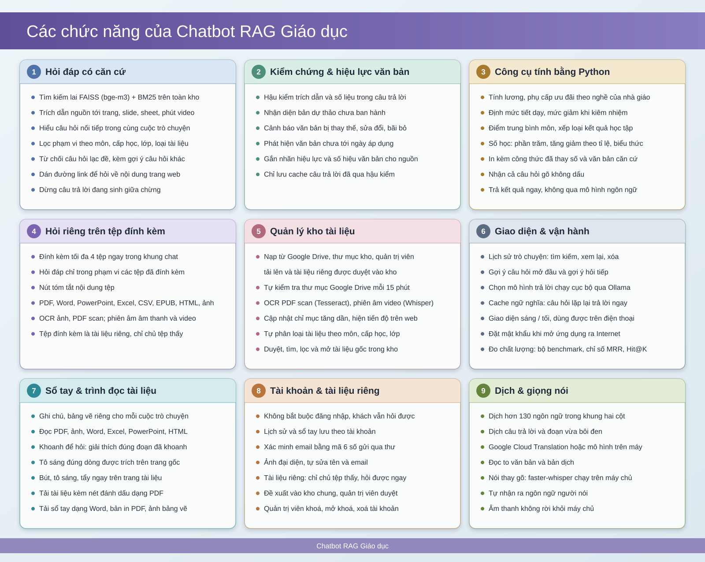
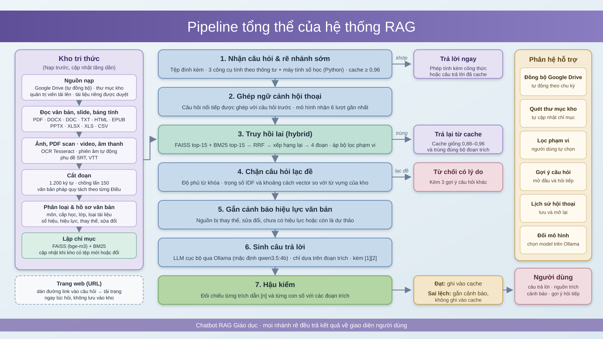
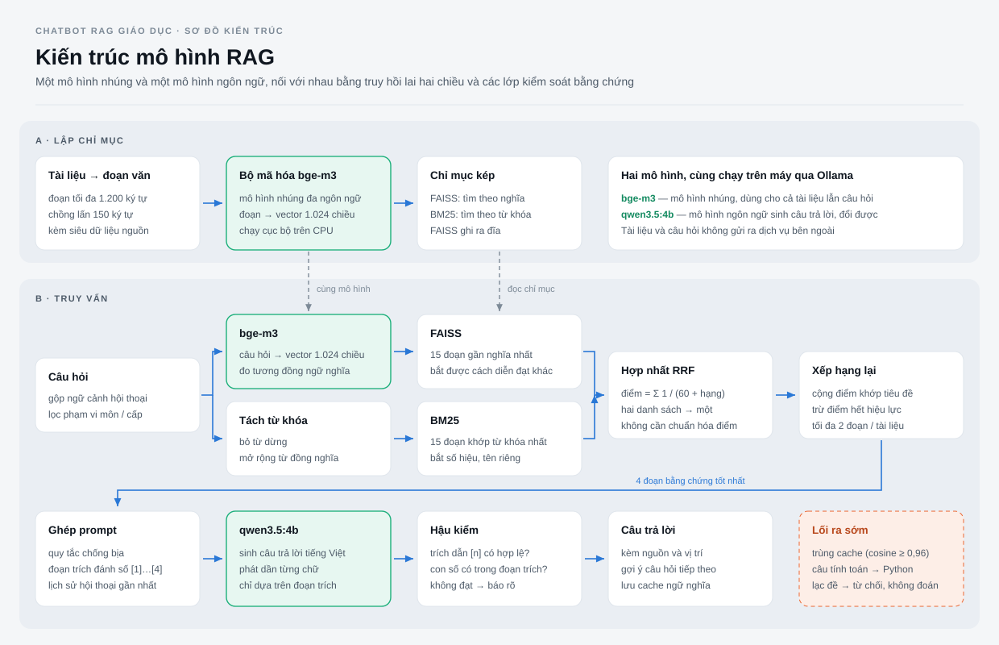
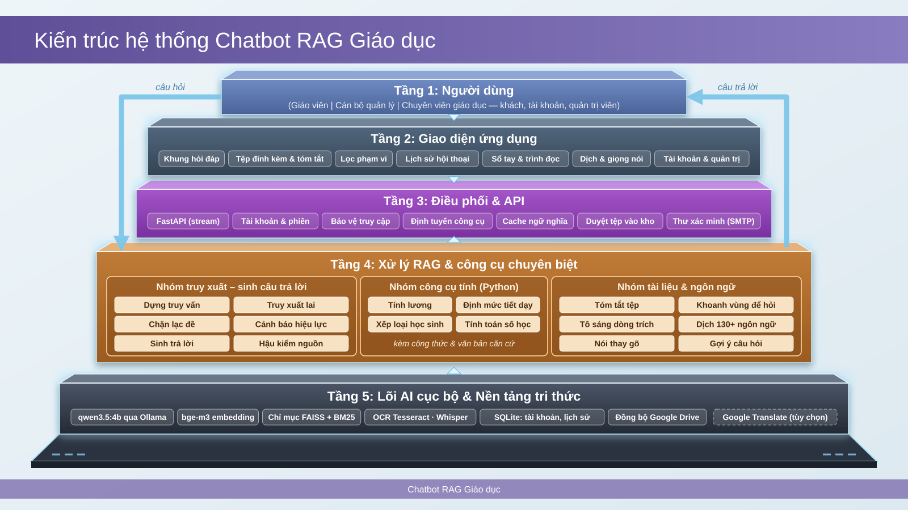
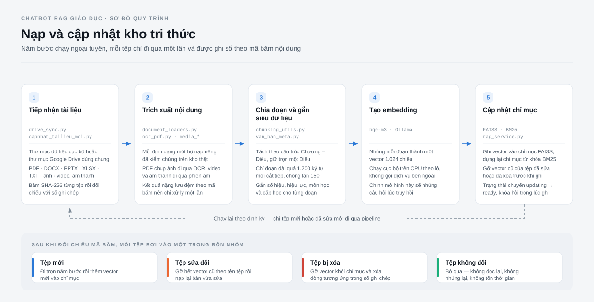
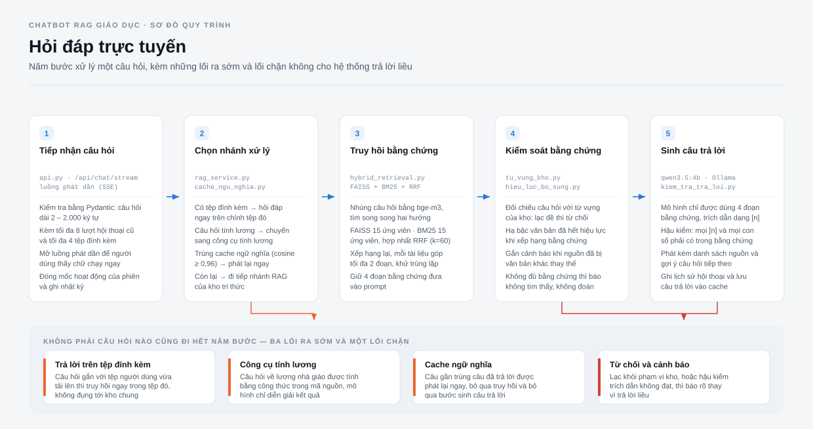
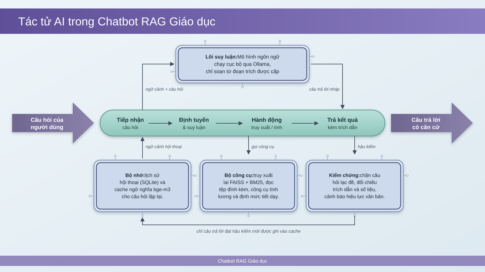

# Chatbot RAG Giáo dục

**Trường Đại học Sư phạm Thành phố Hồ Chí Minh**
**Khoa Công nghệ thông tin**

Học viên thực hiện:

1. Tăng Ngọc Phụng - KHMT836027
2. Hoàng Châu Ngọc Phương - KHMT836028
3. Lê Thị Mai Len - KHMT836015

Giảng viên hướng dẫn: TS. Nguyễn Minh Hải

**Bản chạy trực tuyến:** <https://chatbot.148-113-237-209.sslip.io/>

---

Ứng dụng hỏi đáp tài liệu giáo dục chạy cục bộ bằng FastAPI, Ollama, FAISS và giao diện web tiếng Việt. Hệ thống hỗ trợ:

- Tìm kiếm lai FAISS + BM25, trích dẫn nguồn kèm vị trí trong tài liệu, chặn câu hỏi ngoài phạm vi kho
- Cập nhật chỉ mục tăng dần (chỉ xử lý tệp thêm, sửa hoặc xóa)
- Đọc PDF, Word (`.docx`, `.doc`), PowerPoint (`.pptx`), Excel/CSV, TXT, Markdown, HTML, EPUB
- OCR PDF scan và ảnh bằng Tesseract
- Phiên âm video/âm thanh offline bằng faster-whisper, đọc phụ đề `.srt`/`.vtt`
- Tệp đính kèm trong cuộc trò chuyện, lịch sử chat, cache ngữ nghĩa
- Tài khoản người dùng và quyền quản trị; tệp người dùng gửi lên phải được duyệt mới vào kho
- Sổ tay bên cạnh cuộc trò chuyện: ghi chú, bảng vẽ, trình đọc PDF/ảnh với công cụ **Khoanh để hỏi**
- Dịch hơn 130 ngôn ngữ ngay trong giao diện
- Nói thay vì gõ: nhận giọng nói bằng faster-whisper trên máy chủ, tự nhận ra ngôn ngữ
- Mỗi người tự chọn mô hình trả lời cho câu hỏi của mình
- Đồng bộ thư mục Google Drive
- Chế độ chạy công khai có mật khẩu qua đường hầm Cloudflare, bộ script triển khai lên VPS

## Sơ đồ hệ thống

### Các chức năng



### Pipeline tổng thể

Hai luồng tách biệt về thời gian: luồng ngoại tuyến biến tài liệu thô thành chỉ mục, luồng trực tuyến chỉ đọc chỉ mục đó để trả lời.



### Kiến trúc mô hình

`bge-m3` nhúng cả tài liệu lẫn câu hỏi; truy hồi lai FAISS + BM25 hợp nhất bằng RRF rồi xếp hạng lại; `qwen3.5:4b` sinh câu trả lời chỉ từ 4 đoạn bằng chứng và được hậu kiểm trích dẫn, số liệu.



### Các tầng xử lý

Năm tầng từ người dùng, giao diện, điều phối, xử lý chuyên biệt đến lõi AI và nền tảng tri thức.



### Nạp và cập nhật kho tri thức



### Hỏi đáp trực tuyến



### Tác tử AI

Mô hình ngôn ngữ chạy cục bộ qua Ollama và chỉ soạn câu trả lời từ các đoạn trích được cấp.



## Tính năng trên giao diện

### Tài khoản và quyền quản trị

Không bắt buộc đăng nhập: khách vẫn hỏi đáp như thường. Khi đăng nhập, lịch sử chat và sổ tay được lưu trên máy chủ theo tài khoản nên mở ở máy khác vẫn thấy. Chỉ tài khoản quản trị mới được cập nhật chỉ mục, đổi mô hình mặc định, đồng bộ Drive và quản lý kho.

Mật khẩu băm bằng scrypt, phiên đăng nhập nằm trong cookie HttpOnly và máy chủ chỉ giữ bản băm của phiên. Nếu không đặt `RAG_EMAIL_QUAN_TRI` thì tài khoản đăng ký đầu tiên là quản trị viên. Chưa có máy chủ gửi thư, nên quản trị viên xử lý tài khoản bằng dòng lệnh:

```powershell
.\.venv\Scripts\python.exe tai_khoan.py dat-lai-mat-khau email@truong.edu.vn
.\.venv\Scripts\python.exe tai_khoan.py quan-tri email@truong.edu.vn
.\.venv\Scripts\python.exe tai_khoan.py danh-sach
```

### Quản lý kho tài liệu

- Quản trị viên tải tệp lên (nút `+` trong Kho tài liệu hoặc đính kèm) thì tệp vào thẳng kho, có ghi tên người đưa vào.
- Người dùng khác đính kèm tệp vẫn hỏi đáp được ngay trong cuộc trò chuyện của họ, nhưng bản gửi vào kho nằm trong hàng chờ cho tới khi quản trị viên duyệt.
- Tài liệu bị gỡ khỏi kho được chuyển vào thùng rác và khôi phục được; chỉ mục bỏ nội dung của tệp ở lần cập nhật kế tiếp.

### Sổ tay của cuộc trò chuyện

Mỗi cuộc trò chuyện có một cuốn sổ riêng nằm bên cạnh (phím tắt `Ctrl + /`):

- **Ghi chú**: gõ tự do, hoặc chép nhanh câu trả lời và đoạn đã bôi đen.
- **Bảng vẽ**: vẽ tay sơ đồ, công thức.
- **Tài liệu**: đọc thẳng PDF hoặc ảnh chụp trang sách. Chọn **Khoanh để hỏi** rồi kéo một khung chữ nhật (như Snipping Tool) quanh đoạn chưa hiểu; máy chủ đọc đúng chữ trong khung (lớp chữ của PDF, hoặc OCR ở 300 DPI nếu là bản scan) để bấm **Giải thích**, **Hỏi câu khác** hay **Ghi vào sổ**. Trang được render ở máy chủ bằng `pypdfium2`.

Sổ tay tải về được dạng Word, bản in PDF hoặc ảnh bảng vẽ.

### Dịch đa ngôn ngữ

Nút **Dịch** mở khung dịch hai cột như Google Translate cho 133 ngôn ngữ: mỗi chiều hiện ba ngôn ngữ dùng gần đây, nút mũi tên mở bảng tìm theo tên tiếng Việt, tên bản địa hoặc mã (`Pháp`, `français`, `fr`). Có thể đọc to văn bản, sao chép, ghi bản dịch vào sổ tay, dịch câu trả lời ngay dưới câu trả lời và dịch đoạn vừa bôi đen.

- Có `RAG_GOOGLE_TRANSLATE_KEY` thì dịch bằng Google Cloud Translation (văn bản được gửi sang Google, giao diện có ghi chú).
- Không có key thì dịch bằng mô hình nhỏ trên máy (mặc định `qwen2.5:3b-instruct`), đi qua tiếng Anh làm trung gian với các cặp không có tiếng Anh. Chất lượng chỉ để tham khảo; với ngôn ngữ mô hình chưa thạo (ngoài khoảng 19 ngôn ngữ phổ biến), giao diện báo trước bản dịch có thể sai nhiều.

### Nói thay vì gõ

Nút **Nói** trong khung hỏi ghi âm câu hỏi (tự dừng sau 60 giây, `Esc` để huỷ). Máy chủ chuyển giọng nói thành chữ bằng faster-whisper (cùng mô hình dùng để phiên âm video) và tự nhận ra người dùng nói tiếng gì, rồi chèn chữ vào ô câu hỏi để xem lại trước khi gửi. Âm thanh không rời máy chủ. Trình duyệt chỉ cho dùng micro khi trang mở qua `https` hoặc `localhost`.

### Chọn mô hình trả lời

Mỗi người chọn mô hình trả lời cho câu hỏi của mình trong menu mô hình mà không làm đổi mô hình mặc định của máy chủ; tên lạ hoặc bị chặn thì máy chủ tự quay về mô hình mặc định. `RAG_MO_HINH_CHO_PHEP` giới hạn danh sách được chọn, ví dụ chặn mô hình lớn trên máy ít RAM.

## Yêu cầu

- Windows 10/11 và Python 3.11
- [Ollama](https://ollama.com/) đang chạy
- Model embedding `bge-m3`
- Một model hội thoại, mặc định `qwen3.5:4b` (đổi bằng biến môi trường `RAG_LLM_MODEL` hoặc chọn trên giao diện)
- Tesseract OCR (kèm dữ liệu tiếng Việt `vie`) nếu cần đọc PDF scan hoặc ảnh
- Microsoft Word hoặc LibreOffice nếu cần đọc tệp `.doc` đời cũ
- Tuỳ chọn: model `qwen2.5:3b-instruct` để dịch khi không có khóa Google Cloud Translation. Model faster-whisper `small` (khoảng 480 MB) tự tải ở lần phiên âm hoặc nhận giọng nói đầu tiên.

## Cài đặt

```powershell
py -3.11 -m venv .venv
.\.venv\Scripts\python.exe -m pip install -r requirements.txt
ollama pull bge-m3
ollama pull qwen3.5:4b
```

Đặt tài liệu vào thư mục (có thể đổi bằng biến `RAG_DATA_PATH`):

```text
ollama-rag-desktop/data_giao_duc
```

Tạo chỉ mục lần đầu:

```powershell
.\.venv\Scripts\python.exe main.py
```

Khởi động giao diện:

```powershell
.\start_ui.bat
```

`start_ui.bat` cố định cổng `8010` và tự mở trình duyệt tại `http://127.0.0.1:8010`. Nếu chạy trực tiếp `run_ui.py` mà không đặt `RAG_PORT`, ứng dụng chọn cổng trống đầu tiên từ `8000` đến `8020`.

## Cập nhật tài liệu

Sau khi thêm, sửa hoặc xóa tài liệu trong kho, có thể cập nhật chỉ mục từ giao diện hoặc chạy:

```powershell
.\.venv\Scripts\python.exe capnhat_tailieu_moi.py
```

Kết quả OCR, phiên âm và sổ ghi chép giúp lần chạy tiếp theo tiếp tục mà không xử lý lại toàn bộ kho.

## Đo chất lượng hệ thống

Bộ câu hỏi chuẩn nằm ở `bo_cau_hoi_benchmark.json` (127 câu, trong đó 97 câu có nhãn nguồn đúng và 30 câu cố tình ngoài phạm vi kho).

```powershell
.\.venv\Scripts\python.exe benchmark_chatbot.py --ir
```

Chế độ `--ir` đo chất lượng **xếp hạng** của khối truy hồi bằng bộ chỉ số IR/QA kinh điển — MRR, Hit@K, Recall@K, nDCG@K, MAP (công thức nằm trong `chi_so_ir.py`). Không gọi LLM nên chạy vài phút, kết quả ghi ra `ket_qua_chi_so_ir.json` và bảng markdown `bang_chi_so_ir.md`.

Hai chế độ còn lại: `--nhanh` đo truy hồi kèm cổng chặn lạc đề, `--bo` gọi đủ LLM để đo thêm trích dẫn và số liệu (chậm, khoảng 150 giây/câu trên CPU).

Kiểm thử tự động nằm trong thư mục `tests`:

```powershell
.\.venv\Scripts\python.exe -m pip install pytest
.\.venv\Scripts\python.exe -m pytest
```

## Cấu hình Google Drive

Sao chép `khoa_api.mau.bat` thành `khoa_api.bat`, sau đó điền khóa API của riêng bạn. `start_ui.bat` tự nạp tệp này nếu có. `khoa_api.bat` đã được loại khỏi Git để tránh công khai khóa.

## Biến cấu hình cho các tính năng mới

| Biến | Mặc định | Ý nghĩa |
| --- | --- | --- |
| `RAG_KHOA_QUAN_TRI` | `1` | `0` tắt khóa quản trị (máy cá nhân một người dùng) |
| `RAG_EMAIL_QUAN_TRI` | trống | Email quản trị viên, phân cách bằng dấu phẩy; trống thì tài khoản đầu tiên là quản trị |
| `RAG_MO_HINH_CHO_PHEP` | trống | Các mô hình người dùng được tự chọn; trống là mọi mô hình |
| `RAG_GOOGLE_TRANSLATE_KEY` | trống | Khóa Google Cloud Translation; trống thì dịch bằng mô hình trên máy |
| `RAG_MO_HINH_DICH` | `qwen2.5:3b-instruct` | Mô hình dịch trên máy (không có thì dùng mô hình trả lời) |
| `RAG_WHISPER_MODEL` | `small` | Mô hình faster-whisper cho phiên âm và nhận giọng nói |
| `RAG_WHISPER_BEAM_GIONG_NOI` | `5` | Beam size khi nhận giọng nói |

## Chạy công khai

Sao chép `mat_khau.mau.bat` thành `mat_khau.bat`, đặt tài khoản và mật khẩu, rồi chạy:

```powershell
.\chay_cong_khai.bat
```

Ứng dụng bật lớp bảo vệ truy cập (từ chối chạy nếu thiếu mật khẩu) và mở đường hầm Cloudflare, in ra địa chỉ dạng `https://....trycloudflare.com`. Cần cài sẵn `cloudflared`. Hướng dẫn triển khai lên VPS nằm trong [trien_khai_vps/HUONG_DAN.md](trien_khai_vps/HUONG_DAN.md).

## Dữ liệu không nằm trong repository

Repository chỉ chứa mã nguồn. Tài liệu gốc, chỉ mục FAISS và các bản sao lưu của nó, cache OCR, bản phiên âm, lịch sử chat, cơ sở dữ liệu tài khoản và hàng chờ duyệt (`*.db`), khóa API, mật khẩu và cấu hình riêng của máy không được commit vì có thể chứa dữ liệu riêng tư hoặc tệp dung lượng lớn.

Xem thêm [hướng dẫn chạy giao diện](HUONG_DAN_CHAY_GIAO_DIEN.md) (bảng biến môi trường, API) và [tài liệu bàn giao](HUONG_DAN_BAN_GIAO_UI.md).
